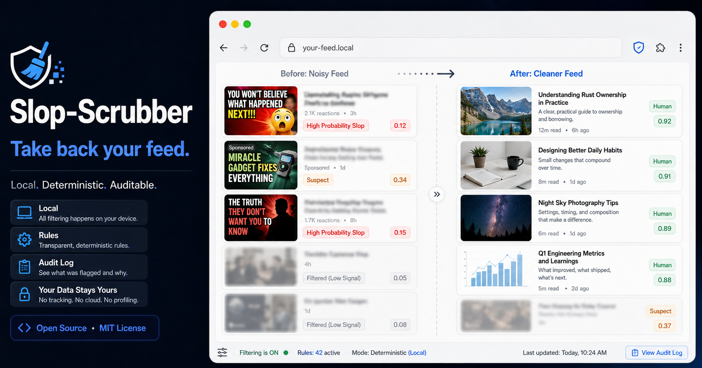

# Slop-Scrubber



**Take back your feed.**

The web has a quality problem. Content farms generate thousands of articles designed less to inform than to capture clicks. Advertisers pay to have sponsored posts dressed up as editorial. Platforms built around engagement have every incentive to show what holds attention longest, not what is worth reading.

Slop-Scrubber is a local Chrome extension and Python scoring library that gives readers a practical way to push back. It scores feed cards, recommendations, and article teasers against transparent local rules for disguised ads, listicle patterns, punctuation noise, and other low-signal content markers.

Cards that score clean pass through untouched. Suspicious cards get a visual flag. High-confidence matches are visually suppressed with blur, but remain available with a click. A popup shows the live breakdown for each site, including which rules triggered and a domain-level toggle.

## Why It Exists

Slop-Scrubber is closer in spirit to an ad blocker than to a recommender. It does not try to decide what you should read. It gives you a local, voluntary, auditable filter for a feed environment that is usually opaque and optimized against your attention.

The project is built around four constraints:

- Local execution: no account, no backend, no content exfiltration.
- Deterministic scoring: no model inference and no hidden classifier.
- Editable rules: weights, thresholds, sentinels, and regex patterns live in JSON.
- Reversible UI: blocked content is blurred, not deleted.

## Quick Install

If you just want the browser extension, download the prebuilt release zip from the GitHub Releases page, unzip it locally, and load the unzipped folder in Chrome as an unpacked extension.

1. Download `slop-scrubber-extension-v0.1.3.zip` from Releases.
2. Unzip it.
3. Open `chrome://extensions`.
4. Enable Developer Mode.
5. Click "Load unpacked" and select the unzipped `slop-scrubber-extension-v0.1.3/` folder.

Chrome does not install this package directly from the zip file. It must be unzipped first.

## What It Does

When you browse, the extension scores candidate DOM elements as `{ title, excerpt, publisher }` cards. The scorer looks for structural and textual signals such as sponsored layout tokens, configured sentinel phrases, numbered and non-numeric clickbait headline patterns, punctuation noise, and em-dash usage classes.

The result is a Slop Score Index from `0` to `100`. The browser extension uses that score to pass, flag, or suppress matching cards. The Python library and CLI use the same rules for offline testing and calibration.

## Status

Slop-Scrubber is under active development. The scorer is deterministic and auditable, the Chrome extension runs under Manifest V3, the rules are versioned, and Python/JavaScript parity is tested with shared fixtures. Contributions, calibration feedback, and rule proposals are welcome; see [CONTRIBUTING.md](CONTRIBUTING.md).

## Architecture

```text
DOM / feed card
    |
    v
parser.py  -> normalize into { title, excerpt, publisher }
    |
    v
scorer.py  -> apply local regex, typography, and structural penalties
    |
    +--> rules.json -> weights, thresholds, sentinel words
    |
    v
extension/content.js -> flag or suppress matching DOM nodes
    |
    v
popup.js -> show per-domain counts and rule breakdown
```

## Install

```bash
python3 -m venv .venv
. .venv/bin/activate
pip install -e .
pip install -r requirements-dev.txt
```

## CLI Usage

Score a raw text blob:

```bash
slop-scrubber score --text "Sponsored: click here"
```

Score a content card:

```bash
slop-scrubber score --title "10 Habits of Highly Effective People" --excerpt "" --publisher "Example"
```

Use a non-default rules file:

```bash
slop-scrubber score --rules config/rules.json --text "Sponsored: click here"
```

The CLI writes JSON to stdout:

```json
{"breakdown":{"sentinel:sponsored":35},"bucket":"Suspect (Highlight)","matched_rules":["sentinel:sponsored"],"score":35}
```

## How Scoring Works

The scorer extracts text from a raw string or a `{ title, excerpt, publisher }` card, applies rule weights from `config/rules.json`, clamps the final value to `0-100`, and returns a bucket.

| Bucket | Score range | Behavior |
|---|---:|---|
| Human | 0-24 | Pass through |
| Suspect (Highlight) | 25-59 | Visually flag |
| High Probability Slop (Block) | 60-100 | Visually suppress |

## Rules and Weights

`exact_ad_layout_token` controls instant high-confidence layout-token matches such as `AmazonSponsored`.

`sponsored_sentinel` controls text matches for configured sponsored/native-ad phrases.

`typography_noise` controls punctuation clusters such as `!!!` and `....`.

`title_fragment` controls short title-case fragments that resemble compact feed labels.

`headline_like` controls numbered headline/listicle patterns.

`headline_why_wrong`, `headline_truth_bait`, `headline_nobody_tells_you`, `headline_this_is_why`, `headline_heres_why`, `headline_heres_what`, `headline_you_wont_believe`, `headline_why_it_matters`, and `headline_what_it_means_for_you` control higher-confidence non-numeric clickbait structures.

`parenthetical_dash` controls em-dash parentheticals such as `X - which is Y - Z` using the actual em-dash character.

`serial_dash` and `serial_dash_step` control repeated em-dash chains.

`list_descriptor_dash` controls list-item descriptor patterns.

`heading_style_dash` controls heading-like em-dash patterns.

`colon_candidate_dash` controls em-dash uses that look like colon substitutions.

`comma_candidate_dash` controls em-dash uses that look like comma substitutions.

`single_dash_fallback`, `multi_dash_fallback`, and `multi_dash_step` control remaining em-dash cases after the ordered classifier has run.

## Heuristics

The em-dash classifier is intentionally ordered. It first checks for parenthetical and serial constructions, then list descriptors, heading-style labels, colon candidates, comma candidates, and finally fallback cases. This preserves the same linguistic branch order in the Python and JavaScript scorers.

`headline_like` remains intentionally narrow and only covers numeric-prefix listicles. Broader clickbait patterns now live in separate `headline_*` rules so they can be tuned independently.

Typography noise intentionally excludes em dashes. Em-dash handling belongs to the classifier; typography noise is reserved for punctuation clusters that are not otherwise classified.

## Browser Extension

Build the extension bundle:

```bash
python scripts/build_extension.py
```

This creates `dist/extension/`, copies the browser files from `src/extension/`, copies `config/rules.json` into `dist/extension/config/rules.json`, and writes a manifest with resource paths relative to the extension root.

Package a downloadable release zip:

```bash
python scripts/build_extension.py --package
```

This also writes `dist/releases/slop-scrubber-extension-v0.1.3.zip`, which is the file attached to GitHub Releases for less technical users.

To load it in Chrome, open `chrome://extensions`, enable Developer Mode, choose "Load unpacked", and select `dist/extension/`.

Rebuild `dist/extension/` after any change to `src/extension/` or `config/rules.json`.

To verify the build is current without rebuilding:

```bash
python scripts/build_extension.py --check
```

## Tests

Run the Python suite:

```bash
pytest -q
```

Run the JavaScript scorer suite:

```bash
node tests/test_scorer.js
```

Verify that the Python and JavaScript scorers produce identical results across a shared set of fixtures:

```bash
python scripts/check_parity.py
```
